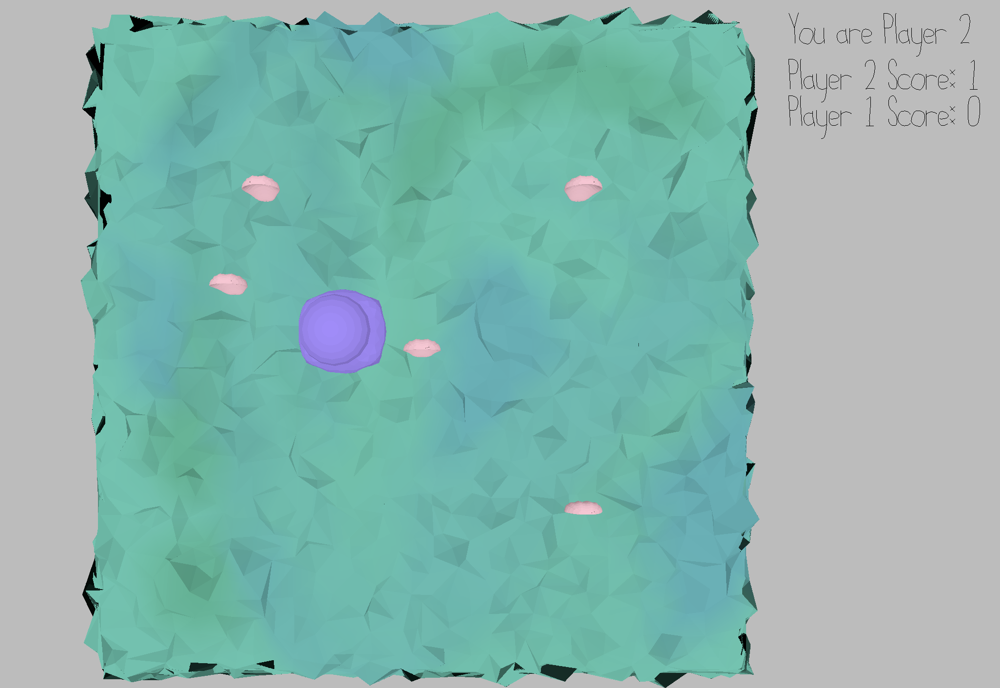

# Clam Collector

Author: Flora Cheng

# Note: I didn't finish this so this is probably going to be my dropped game

Design: You are an octopus trying to collect as many clam shells as possible! The catch? Other octopi are also collecting the shells. Because you all are octopi, you guys can't see each other! No worries, you all come with ink jets that can color opponents for others to see as well and cause them to loose shells!

Networking: 
Through the player presses, the movement of the player is sent to the server using the send and recieve functions from Game.cpp. Some other information that is sent between the server and client are the location of the shells, the other players, and the overall scores of the players.

<!-- (TODO: How does your game implement client/server multiplayer? What messages are transmitted? Where in the code?) -->

Screen Shot:

How To Play:
Use WASD to move and collect the shells!

(this hasn't been fully implemented yet) Use space to ink other players -- note that there is cool down.
<!-- (TODO: describe the controls and (if needed) goals/strategy.) -->

Sources: (TODO: list a source URL for any assets you did not create yourself. Make sure you have a license for the asset.)

This game was built with [NEST](NEST.md).

